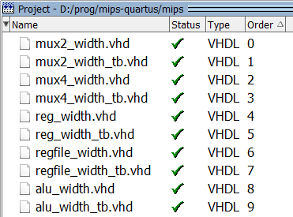

# MIPS on Quartus II

Multicycle MIPS microarchitecture on Quartus II 13.0sp1, focused on Terasic DE0 Development board.
The multicycle microarchitecture is based on chapter 7 of Harris' *Digital Design and Computer Architecture*.

## Requirements

All software below can be downloaded for free at <https://fpgasoftware.intel.com/13.0sp1/?edition=web>

* Altera Quartus II 13.0sp1 Web Edition
* ModelSim (bundled with Quartus II 13.0)
* Cyclone III device support

## Instructions

1. Clone this repository or download as a zip
2. Make a copy of `mips.qsf.default` named `mips.qsf`
3. Choose a top-level entity (optional): on Quartus II, Project Navigator, Files tab,
    right-click on the desired file and select "Set as Top-Level Entity"

## Simulation/Testbench

Since ModelSim doesn't create project files with relative paths, you will need to create a project and include the files manually. See Kashani-Akhavan's tutorial, sections 4 and 5.

When adding files to ModelSim project, make sure the compile order is correct by adding first the DUT file, and then the testbench file. You can see the files' order on the Project tab.

Set the VHDL version to 2008 (`View` > `Properties` > `VHDL` > `Use 1076-2008`).

When simulating macroblocks (e.g. `datapath`, `control_unit`), make sure all its internal blocks are added to the project, otherwise it won't work.

Some testbenches were generated with the aid of Doulos' online tool.

## References

* Doulos. *VHDL Testbench Creation Using Perl*. <http://www.doulos.com/knowhow/perl/testbench_creation/>
* Harris, D., & Harris, S. (2010). *Digital Design and Computer Architecture*. Morgan Kaufmann.
* Kashani-Akhavan, Sahand. *VHDL Testbench Tutorial*. <https://moodle.epfl.ch/pluginfile.php/1833321/mod_resource/content/1/vhdl_testbench_tutorial.pdf>
* Nandland. *VHDL Tutorials and Examples*. <https://www.nandland.com/vhdl/tutorials/index.html>
* Patterson, D. A., & Hennessy, J. L. (2008). *Computer Organization and Design:
    The Hardware/Software Interface*, 4th edition. Morgan Kaufmann.
* Terasic DE0 Board - <http://www.terasic.com.tw/cgi-bin/page/archive.pl?Language=English&CategoryNo=56&No=364>

2018 &mdash; Gutierrez PS
