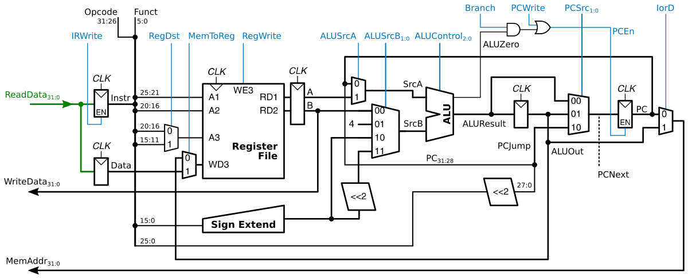
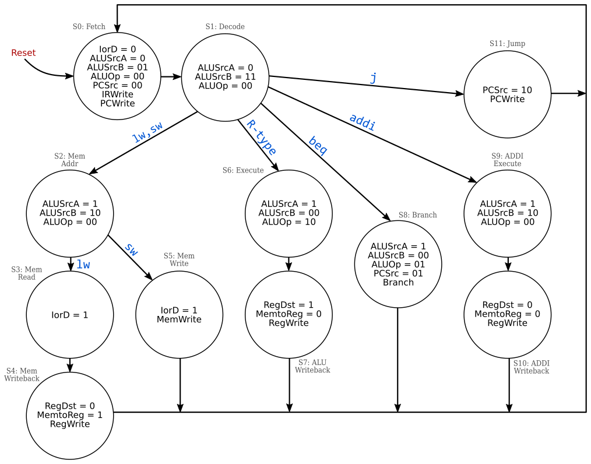

# MIPS

This documents details some aspects of the MIPS processor implemented in this project. The main reference is Harris' *Digital Design and Computer Architecture*.

## [Home](../readme.md)

## Registers

The MIPS architecture defines 32 registers, each one with a name and a matching number. There's a special register, `$zero`, that always holds the value zero.

Name        | Number | Usage
------------|:-----:|-------------------------
`$zero`     | 0     | the constant value 0
`$at`       | 1     | assembler temporary
`$v0-$v1`   | 2-3   | procedure return values
`$a0-$a3`   | 4-7   | procedure arguments
`$t0-$t7`   | 8-15  | temporary values
`$s0-$s7`   | 16-23 | saved variables
`$t8-$t9`   | 24-25 | temporary variables
`$k0-$k1`   | 26-27 | operating system temporaries
`$gp`       | 28    | global pointer
`$sp`       | 29    | stack pointer
`$fp`       | 30    | frame pointer
`$ra`       | 31    | procedure return addresss

## Instructions

There are three types of MIPS instructions, according to their operands: R-type, I-type and J-type. All instructions have 32 bits, where the 6 leftmost (31:26) make the field called `opcode` (`op`). The table below shows the instruction set supported by this project.

Instruction             | `op` (`funct`) | Type  | Meaning
------------------------|:------:|:-:|-------------------------------
`add  $s1, $s2, $s3`    | 0 (32) | R | `$s1 = $s2 + $s3`
`sub  $s1, $s2, $s3`    | 0 (34) | R | `$s1 = $s2 - $s3`
`and  $s1, $s2, $s3`    | 0 (36) | R | `$s1 = $s2 & $s3` (bitwise)
`or   $s1, $s2, $s3`    | 0 (37) | R | `$s1 = $s2 | $s3` (bitwise)
`stl  $s1, $s2, $s3`    | 0 (42) | R | `$s1(0) = $s2 < $s3`, `$s1(31:1) = 0`
`lw   $s1, 8($s2)`      | 35     | I | `$s1 = Mem[8 + $s2]`
`sw   $s1, 8($s2)`      | 43     | I | `Mem[8 + $s2] = $s1`
`addi $s1, $s2, 100`    | 8      | I | `$s1 = $s2 + 100`
`beq  $s1, $s2, label`  | 4      | I | `if($s1 == $s2) goto label`
`j    label`            | 2      | J | `goto label`

### R-type

Short for *register type*, uses three registers as operands: two as sources (`rs` and `rt`) and one as a destination (`rd`). The `opcode` is always zero, and the arithmetic operation is defined by the `funct` field. There's also another field, `shamt`, which is not used in this project. The instruction format is `<instr> <rd>, <rs>, <rt>`.

Field   | Bits
--------|-----
`opcode`| 31:26
`rs`    | 25:21
`rt`    | 20:16
`rd`    | 15:11
`shamt` | 10:6
`funct` | 5:0

### I-type

Short for *immediate type*, uses two register operands (`rs` and `rt`) and one 16-bit immediate operand (`imm`). Fields `rs` and `imm` are always used as source operands, whereas `rt` is used as source for `sw` instruction, and as destination for `lw` and `addi` instructions. The `imm` field is sign-extended in order to be used as a 32-bit operand. The instruction format can be `<instr> <rd>, <rs>, <imm>` or `<instr> <rd>, <imm>(<rs>)`.

Field   | Bits
--------|-----
`opcode`| 31:26
`rs`    | 25:21
`rt`    | 20:16
`imm`   | 15:0

### J-type

Short for *jump type*, has only one operand, a 26-bit address. The instruction format is `<instr> <addr>`.

Field   | Bits
--------|-----
`opcode`| 31:26
`addr`  | 25:0

## Processor components

The MIPS processor can be viewed as three main blocks: **datapath**, **control unit** and **instruction/data memory**, illustrated below.


The multicycle datapath is detailed in the picture below (adapted from Harris). Besides the well-known components such as registers, multiplexers and ALU, it has a 32-position register file (described earlier), a sign extender used on the `imm` field, and a couple of left-shifters used to calculate word addresses based on `imm` (I-type) and `addr` (J-type) instruction fields.



The Arithmetic/Logic Unit (ALU) performs the operations below between input operands *A* and *B*, according to the control input. The outputs are *Res*, the result, and a flag named *Zero* that is true if all bits from *Res* are zero. The operation *Set if Less Than* (SLT) makes *Res* = 1 if *A* < *B*, and *Res* = 0 otherwise.

Control | Function
--------|------------------
000     | *A* AND *B*
001     | *A* OR *B*
010     | *A* + *B*
011     | not used
100     | *A* AND (NOT *B*)
101     | *A* OR (NOT *B*)
110     | *A* - *B*
111     | SLT (*Res* = *A* < *B*)

Inside the control unit there's a finite-state machine, detailed in the diagram below, and a combinational circuit that issues the ALU control signal according to the instruction being executed.



ALUOp   | Funct | ALUControl
--------|-------|---------------
00      | X     | 010 (add)
X1      | X     | 110 (subtract)
1X      | 100000| 010 (add)
1X      | 100010| 110 (sub)
1X      | 100100| 000 (and)
1X      | 100101| 001 (or)
1X      | 101010| 111 (slt)

## Test program

The following program is designed to test the processor by using instructions that cover all states from the finite state machine inside the control unit. It uses memory address 0x8000 (32768) as a counter from 0 to 9, by loading it to `$s0`, using `$s1` as increment, storing the increment result on `$s2` and then storing it back on memory if it's less than 10.

```plain
        addi    $gp, $zero, 32767
        addi    $gp, $gp, 1             # $gp = 0x00008000
        addi    $s3, $zero, 10
reset:  sw      $zero, 0($gp)
loop:   lw      $s0, 0($gp)
        addi    $s1, $zero, 1
        add     $s2, $s0, $s1
        beq     $s2, $s3, reset
        sw      $s2, 0($gp)
        j       loop
```

The assembled program is listed below, adapted from [Alan Hogan's MIPS Assembler](https://alanhogan.com/asu/assembler.php). The first column is the memory address, and the second one is the hex representation of each instruction. On the original output, the address starts at `0x00400000`, but since this is a limited MIPS, our programs must start at the first memory position. Data can be stored on memory starting from position `0x00008000`, since it's the furthest to the left that a bit can be set by using a 16-bit immediate and the supported instructions.

```plain
00000000: 201c7fff ; <input:0> addi $gp, $zero, 32767
00000004: 239c0001 ; <input:1> addi $gp, $gp, 1
00000008: 2013000A ; <input:2> addi $s3, $zero, 10
0000000c: <reset> ; <input:3> reset: sw $zero, 0($gp)
0000000c: af800000 ; <input:3> reset: sw $zero, 0($gp)
00000010: <loop> ; <input:4> loop: lw $s0, 0($gp)
00000010: 8f900000 ; <input:4> loop: lw $s0, 0($gp)
00000014: 20110001 ; <input:5> addi $s1, $zero, 1
00000018: 02119020 ; <input:6> add $s2, $s0, $s1
0000001c: 1253fffb ; <input:7> beq $s2, $s3, reset
00000020: af920000 ; <input:8> sw $s2, 0($gp)
00000024: 08000004 ; <input:9> j loop
```

---
2018 &mdash; Gutierrez PS