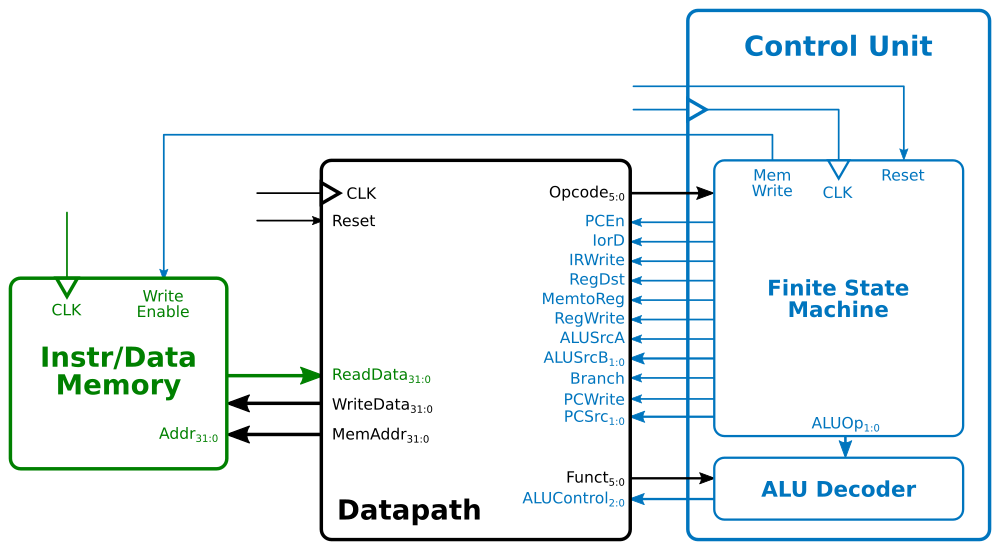

# MIPS

This documents details some aspects of the MIPS processor implemented in this project. The main reference is Harris' *Digital Design and Computer Architecture*.

[Home](../readme.md)

## Registers

The MIPS architecture defines 32 registers, each one with a name and a matching number. There's a special register, `$zero`, that always holds the value zero.

Name        | Number | Usage
------------|:-----:|-------------------------
`$zero`     | 0     | the constant value 0
`$at`       | 1     | assembler temporary
`$v0-$v1`   | 2-3   | procedure return values
`$a0-$a3`   | 4-7   | procedure arguments
`$t0-$t7`   | 8-15  | temporary values
`$s0-$s7`   | 16-23 | saved variables
`$t8-$t9`   | 24-25 | temporary variables
`$k0-$k1`   | 26-27 | operating system temporaries
`$gp`       | 28    | global pointer
`$sp`       | 29    | stack pointer
`$fp`       | 30    | frame pointer
`$ra`       | 31    | procedure return addresss

## Instructions

There are three types of MIPS instructions, according to their operands: R-type, I-type and J-type. All instructions have 32 bits, where the 6 leftmost (31:26) make the field called `opcode` (`op`). The table below shows the instruction set supported by this project.

Instruction             | `op` (`funct`) | Type  | Meaning
------------------------|:------:|:-:|-------------------------------
`add  $s1, $s2, $s3`    | 0 (32) | R | `$s1 = $s2 + $s3`
`sub  $s1, $s2, $s3`    | 0 (34) | R | `$s1 = $s2 - $s3`
`and  $s1, $s2, $s3`    | 0 (36) | R | `$s1 = $s2 & $s3` (bitwise)
`or   $s1, $s2, $s3`    | 0 (37) | R | `$s1 = $s2 | $s3` (bitwise)
`stl  $s1, $s2, $s3`    | 0 (42) | R | `$s1(0) = $s2 < $s3`, `$s1(31:1) = 0`
`lw   $s1, 8($s2)`      | 35     | I | `$s1 = Mem[8 + $s2]`
`sw   $s1, 8($s2)`      | 43     | I | `Mem[8 + $s2] = $s1`
`addi $s1, $s2, 100`    | 8      | I | `$s1 = $s2 + 100`
`beq  $s1, $s2, label`  | 4      | I | `if($s1 == $s2) goto label`
`j    label`            | 2      | J | `goto label`

### R-type

Short for *register type*, uses three registers as operands: two as sources (`rs` and `rt`) and one as a destination (`rd`). The `opcode` is always zero, and the arithmetic operation is defined by the `funct` field. There's also another field, `shamt`, which is not used in this project. The instruction format is `<instr> <rd>, <rs>, <rt>`.

Field   | Bits
--------|-----
`opcode`| 31:26
`rs`    | 25:21
`rt`    | 20:16
`rd`    | 15:11
`shamt` | 10:6
`funct` | 5:0

### I-type

Short for *immediate type*, uses two register operands (`rs` and `rt`) and one 16-bit immediate operand (`imm`). Fields `rs` and `imm` are always used as source operands, whereas `rt` is used as source for `sw` instruction, and as destination for `lw` and `addi` instructions. The `imm` field is sign-extended in order to be used as a 32-bit operand. The instruction format can be `<instr> <rd>, <rs>, <imm>` or `<instr> <rd>, <imm>(<rs>)`.

Field   | Bits
--------|-----
`opcode`| 31:26
`rs`    | 25:21
`rt`    | 20:16
`imm`   | 15:0

### J-type

Short for *jump type*, has only one operand, a 26-bit address. The instruction format is `<instr> <addr>`.

Field   | Bits
--------|-----
`opcode`| 31:26
`addr`  | 25:0

## Processor components

The MIPS processor can be viewed as three main blocks: **datapath**, **control unit** and **instruction/data memory**, illustrated below.

